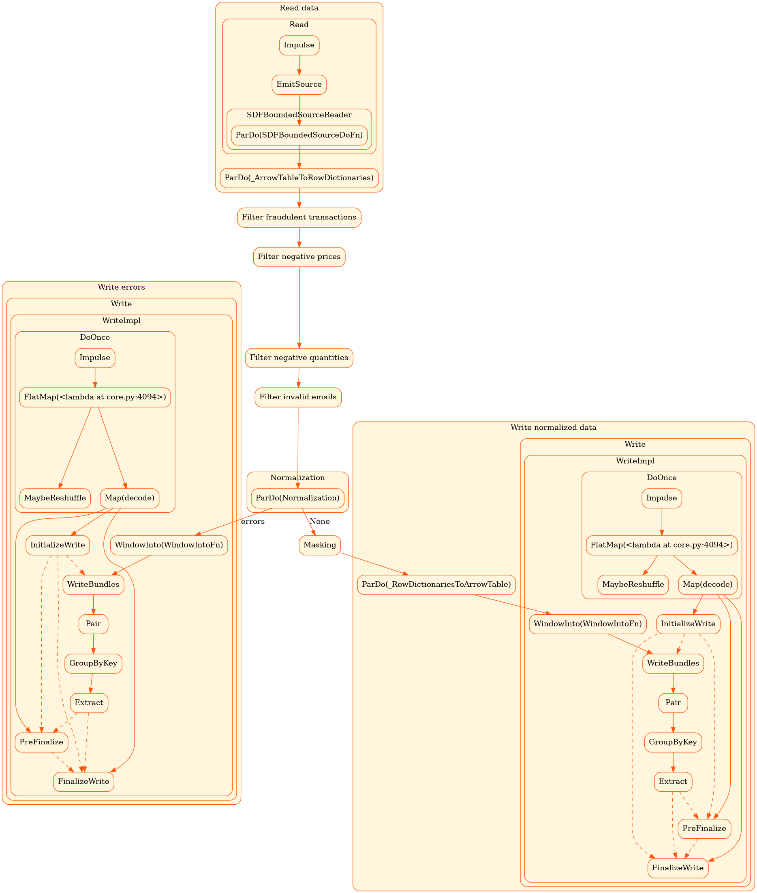

# 🛒 ecommerce_beam

> **Pipeline de procesamiento de datos de e-commerce con Apache Beam y datos sintéticos generados con Faker.**

Este proyecto tiene como objetivo **practicar y reforzar conceptos clave del procesamiento de datos** aplicados a un escenario realista: eventos de compra de una plataforma de e-commerce ficticia.

No se trata de un sistema productivo, sino de un entorno controlado donde los datos contienen errores intencionales, valores nulos, formatos inconsistentes y registros fraudulentos para que el pipeline tenga trabajo real que hacer.

---

## 📋 Tabla de contenidos

- [Objetivo del proyecto](#-objetivo-del-proyecto)
- [Arquitectura general](#-arquitectura-general)
- [Estructura del proyecto](#-estructura-del-proyecto)
- [Instalación](#-instalación)
- [Parte 1 — Generador de datos (`generator.py`)](#parte-1--generador-de-datos-generatorpy)
- [Parte 2 — Pipeline de procesamiento (`main.py`)](#parte-2--pipeline-de-procesamiento-mainpy)
- [Conceptos reforzados](#-conceptos-reforzados)
- [Librerías utilizadas](#-librerías-utilizadas)
- [Pendiente: Análisis de datos](#-pendiente-análisis-de-datos)
- [Gráfico del pipeline](#-gráfico-del-pipeline)

---

## 🎯 Objetivo del proyecto

Este proyecto busca reforzar de forma práctica los siguientes conceptos del procesamiento de datos:

| Concepto                           | Aplicación en el proyecto                                                                                |
| ---------------------------------- | -------------------------------------------------------------------------------------------------------- |
| **Filtrado**                       | Eliminación de transacciones fraudulentas, precios negativos, cantidades inválidas y correos malformados |
| **Normalización**                  | Estandarización de nombres de países y formato de fechas                                                 |
| **Enmascaramiento**                | Ocultación de datos sensibles: email, teléfono, dirección, IP                                            |
| **Manejo de errores**              | Salida secundaria (`TaggedOutput`) para registros que fallan procesamiento                               |
| **Lectura/escritura Parquet**      | Ingesta y persistencia de datos en formato columnar eficiente                                            |
| **Generación de datos sintéticos** | Simulación de errores reales: nulos, duplicados, formatos inválidos                                      |
| **Particionado de datos**          | Escritura particionada por año/mes/día con PyArrow Dataset                                               |

---

## 🏗 Arquitectura general

```
generator.py                      main.py (Apache Beam)
─────────────                     ────────────────────────────────────
Datos ficticios                   Read Parquet (data/**/*.parquet)
con errores           ──────►          │
intencionales                          ▼
                               Filter: is_fraud
                                       │
                                       ▼
                               Filter: price > 0
                                       │
                                       ▼
                               Filter: quantity > 0
                                       │
                                       ▼
                               Filter: email válido
                                       │
                                       ▼
                               Normalization (DoFn)
                               ┌───────┴───────┐
                      (main)   │               │  (errors)
                               ▼               ▼
                           Masking       Write errors.txt
                               │
                               ▼
                    Write normalized_data.parquet
```

---

## 📁 Estructura del proyecto

```
ecommerce_beam/
├── data/                        # Datos generados (particionados por fecha)
│   └── <year>/<month>/<day>/
│       └── part-0.parquet
├── output/                      # Resultados del pipeline
│   ├── normalized_data.parquet  # Datos limpios y enmascarados
│   └── errors.txt               # Registros que fallaron durante el proceso
├── generator.py                 # Generador de datos sintéticos
├── main.py                      # Pipeline Apache Beam
├── ppl_graph.png                # Gráfico visual del pipeline
├── requirements.txt             # Dependencias del proyecto
└── README.md
```

---

## ⚙ Instalación

### Prerrequisitos

- Python 3.10+
- `pip`

### Pasos

```bash
# Clonar el repositorio
git clone <url-del-repositorio>
cd ecommerce_beam

# Crear y activar entorno virtual
python -m venv .venv
source .venv/bin/activate        # Linux/macOS
.venv\Scripts\activate           # Windows

# Instalar dependencias
pip install -r requirements.txt
```

---

## Parte 1 — Generador de datos (`generator.py`)

El generador crea un dataset de eventos de e-commerce con **errores intencionales** para simular la suciedad típica de datos del mundo real.

### Ejecutar

```bash
python generator.py
```

Esto genera archivos Parquet **particionados por año, mes y día** bajo el directorio `data/`:

```
data/
└── 2023/
    └── 07/
        └── 14/
            └── part-0.parquet
```

### Esquema del dataset

| Campo             | Tipo   | Descripción                                        |
| ----------------- | ------ | -------------------------------------------------- |
| `event_id`        | string | UUID del evento (1% puede ser nulo)                |
| `user_id`         | string | UUID del usuario (5% nulo)                         |
| `name`            | string | Nombre del usuario (5% nulo)                       |
| `email`           | string | Email (5% con formato inválido: `invalid_email`)   |
| `phone`           | string | Teléfono (10% con formato incorrecto)              |
| `address`         | string | Dirección (10% nula)                               |
| `country`         | string | País con variantes: `Chile`, `chile`, `CL`, `None` |
| `signup_date`     | string | Fecha de registro en ISO 8601 (10% nula)           |
| `event_timestamp` | string | Timestamp del evento                               |
| `product`         | string | Nombre del producto (puede ser `""` o `None`)      |
| `category`        | string | Categoría (puede ser `None` o `"Tech"`)            |
| `price`           | float  | Precio (puede ser negativo)                        |
| `quantity`        | int    | Cantidad (puede ser negativa)                      |
| `payment_method`  | string | Método de pago (incluye `"invalid"`)               |
| `is_fraud`        | bool   | Si la transacción es fraudulenta (~2% positivo)    |
| `device`          | string | Dispositivo usado                                  |
| `ip_address`      | string | IP (5% con formato inválido: `999.999.999.999`)    |
| `user_agent`      | string | User-agent del navegador                           |
| `discount_code`   | string | Código de descuento (70% nulo)                     |

### Errores intencionales introducidos

- **Precios negativos**: `price` puede ser entre −50 y 2000.
- **Cantidades negativas**: `quantity` puede ser −2, −1, 0 o positivo.
- **Emails inválidos**: 5% de los registros tienen `"invalid_email"` como valor.
- **IPs inválidas**: 5% tienen `"999.999.999.999"`.
- **Países inconsistentes**: Mismo país escrito de distintas formas (`Chile`, `chile`, `CL`).
- **Fechas con hora**: `signup_date` incluye hora completa en ISO 8601 cuando debería ser solo fecha.
- **Nulos en campos clave**: Se aplica aleatoriamente a múltiples columnas con distintas probabilidades.

---

## Parte 2 — Pipeline de procesamiento (`main.py`)

El pipeline está construido con **Apache Beam** y procesa los archivos Parquet generados aplicando una serie de transformaciones en orden.

### Ejecutar

```bash
python main.py
```

> Por defecto el pipeline usa `RenderRunner`, que renderiza el grafo del pipeline sin ejecutarlo. Para ejecutarlo con datos reales, cambia el runner a `DirectRunner`.

### Etapas del pipeline

#### 1. Lectura de datos

```python
data = p | "Read data" >> beam.io.ReadFromParquet('data/**/*.parquet', columns=columns)
```

Lee todos los archivos Parquet particionados, proyectando únicamente las columnas necesarias (sin `user_id`, `user_agent` ni `discount_code`).

#### 2. Filtro de fraude

```python
filter_fraud = data | "Filter fraudulent transactions" >> beam.Filter(lambda x: x['is_fraud'])
```

Elimina eventos marcados como fraudulentos (`is_fraud == True`).

#### 3. Filtro de precios negativos

```python
filter_negative_price = filter_fraud | "Filter negative prices" >> beam.Filter(lambda x: x['price'] > 0)
```

Descarta transacciones con precio igual o menor a cero.

#### 4. Filtro de cantidades negativas

```python
filter_negative_quantity = filter_negative_price | "Filter negative quantities" >> beam.Filter(lambda x: x['quantity'] > 0)
```

Descarta transacciones con cantidad igual o menor a cero.

#### 5. Filtro de emails inválidos

```python
filter_invalid_emails = filter_negative_quantity | "Filter invalid emails" >> beam.Filter(lambda x: x['email'] != 'invalid_email')
```

Elimina registros con el valor literal `"invalid_email"`.

#### 6. Normalización (`Normalization`)

Implementada como `beam.DoFn` con salida de errores etiquetada (`TaggedOutput`):

- **Países**: Estandariza variantes (`Chile`, `chile` → `CL`, `Argentina` → `AR`, `Peru` → `PE`).
- **Fechas**: Extrae solo la parte de fecha de `signup_date` (elimina la hora).
- **Errores**: Si falla el procesamiento, el elemento se envía a la salida `errors`.

#### 7. Enmascaramiento (`Masking`)

Reemplaza campos con datos sensibles por valores genéricos:

| Campo        | Valor enmascarado |
| ------------ | ----------------- |
| `email`      | `***@***.***`     |
| `phone`      | `**********`      |
| `address`    | `**********`      |
| `ip_address` | `***.***.***.***` |

#### 8. Escritura de resultados

| Salida             | Ruta                             | Descripción                                |
| ------------------ | -------------------------------- | ------------------------------------------ |
| Datos normalizados | `output/normalized_data.parquet` | Datos limpios y enmascarados               |
| Errores            | `output/errors.txt`              | Registros que fallaron en la normalización |

---

## 🧠 Conceptos reforzados

### Filtrado

El pipeline aplica múltiples filtros secuenciales usando `beam.Filter`. Cada filtro encadena su salida como entrada del siguiente, construyendo un flujo limpio de datos sin modificar la colección original: fraude → precios inválidos → cantidades inválidas → emails malformados.

### Normalización

La clase `Normalization(beam.DoFn)` centraliza la lógica de estandarización. Se practica la normalización de texto (nombres de países con distintas capitalizations/abreviaciones) y de formatos de fecha (ISO 8601 con y sin hora). El uso de `try/except` dentro del `process()` permite manejar errores sin detener el pipeline.

### Enmascaramiento

La clase `Masking(beam.DoFn)` aplica el principio de **privacy by design**: los campos con información de identificación personal (PII) se reemplazan antes de persistir los datos. Útil en contextos donde los datos deben poder auditarse sin exponer información sensible.

### Salidas etiquetadas (`TaggedOutput`)

Con `with_outputs('errors', main='normalized')` se separan los elementos que fallaron en la normalización hacia un archivo de errores independiente. Este patrón permite auditar qué registros no pudieron procesarse sin perderlos ni detener el pipeline.

### Parquet particionado

El generador escribe los datos usando `pyarrow.dataset.write_dataset()` con particionado por `year/month/day`. Esto simula un Data Lake real donde los archivos se organizan cronológicamente, y el pipeline lo consume con un glob pattern (`data/**/*.parquet`).

---

## 📦 Librerías utilizadas

### `apache-beam`

**Por qué:** Es la librería central del proyecto. Apache Beam es un modelo unificado de procesamiento de datos que permite construir pipelines portables que pueden ejecutarse en distintos runners (local con `DirectRunner`, en Google Cloud con `DataflowRunner`, etc.). Se utiliza por su expresividad, soporte para transformaciones complejas (`DoFn`, `TaggedOutput`), y porque es un estándar en ingeniería de datos.

### `faker`

**Por qué:** Permite generar datos sintéticos realistas: nombres, emails, direcciones, IPs, user-agents y más. Es ideal para crear datasets de prueba sin necesidad de datos reales, cumpliendo con la privacidad y permitiendo introducir errores controlados.

### `pyarrow`

**Por qué:** Librería columnar de alto rendimiento que implementa el formato Apache Arrow. Se usa para definir schemas estrictos, construir tablas en memoria, leer/escribir Parquet y hacer particionado con `pyarrow.dataset`. Es la base de rendimiento de herramientas como Pandas, Spark y DuckDB.

### `pandas`

**Por qué:** Utilizado en el generador para construir DataFrames intermedios antes de convertirlos a tablas Arrow. Facilita el manejo de columnas de fecha con `pd.to_datetime()` y la creación de columnas derivadas (año, mes, día) para el particionado.

---

## 🔬 Pendiente: Análisis de datos

La siguiente etapa del proyecto: **analizar los datos procesados** para extraer insights de los eventos de e-commerce.

A continuación se proponen dos librerías ideales para este propósito:

---

### 🦆 DuckDB

**¿Qué es?** Un motor de base de datos OLAP embebido, sin servidor, que funciona directamente sobre archivos Parquet, CSV o tablas en memoria.

**¿Por qué sirve aquí?**

- Puede leer directamente los archivos `output/normalized_data.parquet` sin ninguna configuración.
- Permite usar SQL estándar para hacer consultas analíticas complejas sobre millones de filas en segundos.
- Es ideal para análisis locales sin necesidad de levantar una infraestructura.

**Ejemplo de uso:**

```python
import duckdb

con = duckdb.connect()

# Cargar el parquet directamente
con.execute("CREATE VIEW data AS SELECT * FROM read_parquet('output/normalized_data.parquet')")

# Analizar distribución de ventas por país
result = con.execute("""
    SELECT
        country,
        COUNT(*) AS total_transacciones,
        ROUND(SUM(price * quantity), 2) AS revenue_total,
        ROUND(AVG(price), 2) AS precio_promedio
    FROM data
    GROUP BY country
    ORDER BY revenue_total DESC
""").df()

print(result)
```

**¿Por qué elegirla?**

- 🚀 Extremadamente rápida para queries analíticas sobre Parquet.
- 🔌 Zero configuración: se instala con `pip install duckdb`.
- 🐍 Integración directa con Pandas y PyArrow.
- 💡 SQL estándar: curva de aprendizaje casi nula.

---

### 📊 Pandas + Matplotlib / Seaborn

**¿Qué es?** El stack de análisis exploratorio más usado en Python: Pandas para manipulación de datos y Matplotlib/Seaborn para visualización.

**¿Por qué sirve aquí?**

- Permite cargar el resultado del pipeline y hacer análisis estadístico clásico (EDA).
- Los gráficos permiten visualizar distribuciones, anomalías y patrones en los datos.
- Excelente para generar reportes o notebooks de análisis documentados.

**Ejemplo de uso:**

```python
import pandas as pd
import matplotlib.pyplot as plt
import seaborn as sns

# Leer el parquet de salida
df = pd.read_parquet('output/normalized_data.parquet')

# Distribución de precios por categoría
plt.figure(figsize=(12, 6))
sns.boxplot(data=df, x='category', y='price', palette='viridis')
plt.title('Distribución de precios por categoría de producto')
plt.xticks(rotation=45)
plt.tight_layout()
plt.savefig('output/price_by_category.png')
plt.show()

# Transacciones por método de pago
payment_counts = df['payment_method'].value_counts()
payment_counts.plot(kind='bar', color='steelblue', title='Transacciones por método de pago')
plt.tight_layout()
plt.savefig('output/payment_methods.png')
plt.show()
```

**¿Por qué elegirla?**

- 📈 Visualizaciones de alta calidad con pocas líneas de código.
- 🔎 Ideal para exploración inicial (EDA) antes de decidir qué analizar en detalle.
- 🧩 Funciona perfectamente con la salida Parquet del pipeline.
- 📓 Perfecto para usar en Jupyter Notebooks como complemento del pipeline.

---

### Comparativa rápida

| Criterio                       | DuckDB               | Pandas + Seaborn                        |
| ------------------------------ | -------------------- | --------------------------------------- |
| Velocidad en grandes volúmenes | ⭐⭐⭐⭐⭐           | ⭐⭐⭐                                  |
| Facilidad de uso               | SQL estándar         | Python nativo                           |
| Visualizaciones                | Requiere integración | Nativo con Matplotlib                   |
| Ideal para                     | Análisis SQL ad-hoc  | EDA y gráficos                          |
| Instalación                    | `pip install duckdb` | `pip install pandas matplotlib seaborn` |

---

## 🖼 Gráfico del pipeline

El siguiente gráfico fue generado automáticamente por el `RenderRunner` de Apache Beam y muestra el grafo de transformaciones del pipeline:



---
> 📝 La documentación de este README fue generada con asistencia de IA y revisada manualmente.

